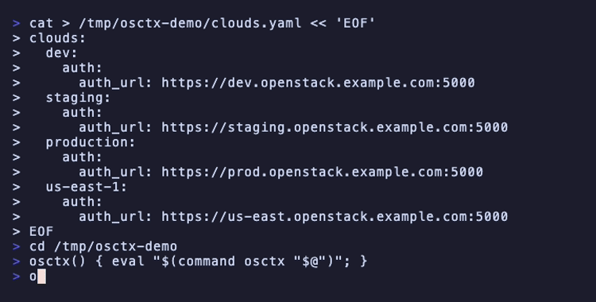

# `osctx`: Interactive switch tool for OpenStack clouds


Interactively switch between OpenStack clouds defined in your `clouds.yaml`.
[Install &rarr;](#installation)

---

## What is `osctx`?

**`osctx`** lets you switch the active OpenStack cloud (`OS_CLOUD`) without
typing long cloud names or editing environment variables by hand. It is
inspired by [`kubectx`](https://github.com/ahmetb/kubectx).

Here's an **`osctx`** demo:



---

## Usage

```sh
# Interactive cloud selection (fzf or numbered fallback)
osctx

# List all clouds from clouds.yaml
osctx ls

# Show current cloud
osctx current

# Clear current cloud
osctx unset
```

### Shell wrapper (required)

Because a subprocess cannot modify its parent shell's environment, `osctx`
prints the export statement to stdout and you must source it. Add this to
your `.bashrc` / `.zshrc`:

```bash
osctx() { eval "$(command osctx "$@")"; }
```

After that, selecting a cloud will automatically set `OS_CLOUD` in your shell.

### Interactive mode

If [`fzf`](https://github.com/junegunn/fzf) is installed, `osctx` opens an
inline fuzzy-finder showing all your clouds. The current cloud appears in the
header so you always know where you are.

If `fzf` is not installed, `osctx` falls back to a numbered list:

```
1) dev
2) staging
3) prod
Select cloud [1-3]:
```

---

## Installation

| Method | Command |
|---|---|
| Go install | `go install github.com/yoyrandao/osctx@latest` |
| Download archive | [Releases page](https://github.com/yoyrandao/osctx/releases) |

Unarchive the binary and place it somewhere on your `$PATH`, then add the shell wrapper above.

> [!NOTE]
> For the best experience, install [`fzf`](https://github.com/junegunn/fzf).
> Without it `osctx` falls back to a numbered-list prompt.

---

## clouds.yaml lookup

`osctx` searches for `clouds.yaml` in order:

1. `./clouds.yaml` (current directory)
2. `$XDG_CONFIG_HOME/openstack/clouds.yaml`
3. `~/.config/openstack/clouds.yaml`
4. `~/.openstack/clouds.yaml`
5. `/etc/openstack/clouds.yaml`

#### Stargazers over time

[](https://starchart.cc/yoyrandao/osctx)